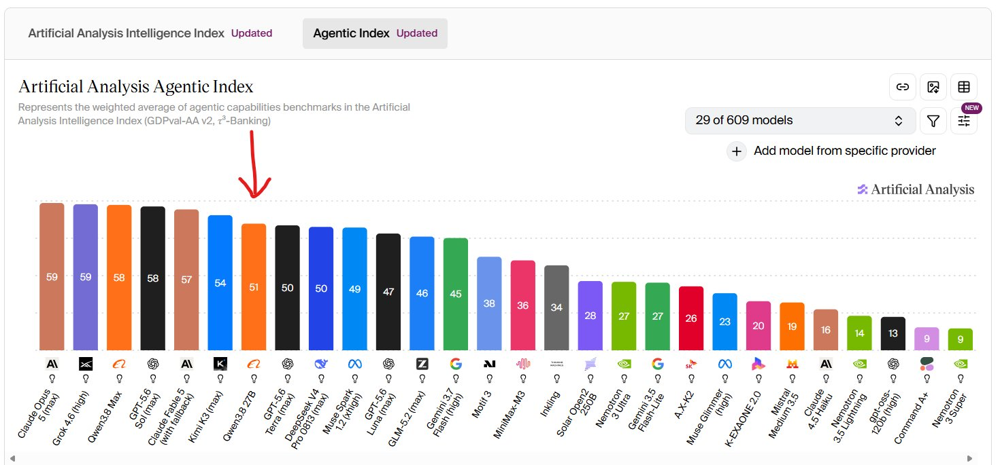

# Local AI vs Cloud AI: A Cost Analysis

What does it actually cost to generate a million tokens on your own GPU, and how
does that compare to paying an API to do it?

This document answers that with measured numbers from one machine: an ASUS TUF
RTX 5090 32GB running Qwen3.8-27B (unsloth UD-Q4_K_XL) on llama.cpp with MTP
speculative decoding enabled. Every power and throughput figure here comes from
a sweep of 105 scenario runs, not from a spec sheet.

**The short version:** electricity is almost free compared to API pricing. Running
the card flat out costs about €50 a month and produces roughly 400 million
tokens. Buying those same tokens from a frontier API would cost somewhere between
€4,700 and €19,700 a month. The cheapest cloud option on the list still costs
about ten times your power bill.

**Scope:** sections 1–4 and 6–7 assume you already own the hardware, and count
running costs only. Section 5 is separate: it is for deciding whether to *buy* a
card, and is the only place the purchase price appears.

---

## 1. The setup

| Item | Value |
|---|---|
| GPU | ASUS TUF RTX 5090 32GB |
| Power range | 400 W minimum, 600 W default and maximum |
| Model | unsloth/Qwen3.8-27B-GGUF UD-Q4_K_XL |
| Context | 131K, q4_0 KV cache |
| Server | llama.cpp b10451, `--parallel 1` |
| Speculative decoding | `--spec-type draft-mtp --spec-draft-n-max 4` |
| OS | Arch Linux, kernel 7.1.8, CUDA |
| Electricity tariff | €0.1199 / kWh |

Two configurations appear throughout:

- **baseline** — speculative decoding off. Roughly 75 tokens/second.
- **n4** — MTP speculative decoding at draft depth 4. Roughly 162 tokens/second.

Power figures are measured draw (95th percentile of 1 Hz sampling during
decoding), not the cap setting. That distinction matters: the card does not
always use the power you allow it.

---

## 2. Power caps: what you give up, what you get back

### 2.1 The speed/energy trade at n-max 4

| Cap | Actual draw | tok/s | Power saved | Speed lost | Energy/token | Efficiency gain | kWh per 1M tok | Hours per 1M tok |
|---|---|---|---|---|---|---|---|---|
| 600 W | 602 W | 162.1 | — | — | 3.71 J | — | 1.032 | 1.71 |
| 550 W | 555 W | 158.8 | −7.8% | −2.0% | 3.50 J | −5.9% | 0.971 | 1.75 |
| 500 W | 511 W | 153.6 | −15.1% | −5.2% | 3.33 J | −10.4% | 0.924 | 1.81 |
| 450 W | 453 W | 142.7 | −24.8% | −12.0% | 3.17 J | −14.5% | 0.882 | 1.95 |
| 400 W | 411 W | 132.8 | −31.7% | −18.1% | 3.09 J | −16.7% | 0.860 | 2.09 |

At 400 W you draw 31.7% less power and give up 18.1% of your speed. Every 1% of
speed you surrender buys about 1.75% of power — a favourable trade in energy
terms at every step.

**There is no efficiency sweet spot in the middle.** Energy per token improves
the whole way down to the 400 W floor. If you are optimising joules per token,
cap as low as the card allows. That differs from the RTX 3090 sweep in this
repository, which found efficiency peaking around 300 W of a 390 W default — on
this card the curve has not turned by the time you hit the legal minimum.

The catch is wall-clock time: 1M tokens takes 1.71 h at 600 W and 2.09 h at
400 W. You save energy per token but occupy the card 22% longer.

### 2.2 Baseline, for comparison

| Cap | Actual draw | tok/s | Power saved | Speed lost | Energy/token | kWh per 1M tok |
|---|---|---|---|---|---|---|
| 600 W | 537 W | 74.8 | — | — | 7.18 J | 1.994 |
| 550 W | 536 W | 74.8 | −0.2% | 0.0% | 7.17 J | 1.990 |
| 500 W | 509 W | 74.5 | −5.2% | −0.4% | 6.83 J | 1.898 |
| 450 W | 464 W | 73.5 | −13.6% | −1.7% | 6.31 J | 1.754 |
| 400 W | 407 W | 71.2 | −24.2% | −4.8% | 5.72 J | 1.588 |

With speculative decoding off, capping is nearly free: down to 500 W you lose
0.4% of speed for 5% less power, and even at the 400 W floor you give up under
5%.

The reason is visible in the draw column. Spec-off decoding tops out at about
537 W — it never reaches a 550 or 600 W ceiling, because it is waiting on memory
bandwidth rather than doing compute. There is no extra work for the watts to do.
Speculative decoding adds real compute (verifying several drafted tokens per
pass), which is why the n4 arm can actually spend a 600 W budget.

### 2.3 The biggest number here

Speculative decoding roughly **halves the energy cost of a token**, at every cap:

| Cap | baseline | n4 | Change |
|---|---|---|---|
| 400 W | 5.72 J | 3.09 J | −45.9% |
| 500 W | 6.83 J | 3.33 J | −51.3% |
| 600 W | 7.18 J | 3.71 J | −48.3% |

The flag is not just a speed feature — it is a ~2× efficiency feature. Same
tokens, half the electricity. That reframes the observation in
`sweeps/multi-gpu.md:99` ("the draft head is not buying speed with watts") as a
stronger claim on this card: it is buying speed *and* saving watts.

---

## 3. What it costs to run

### 3.1 Cost per million tokens

At €0.15/kWh, 1M tokens costs roughly:

- baseline at 600 W: €0.30
- n4 at 600 W: €0.155
- n4 at 400 W: €0.129

So the flag saves about €0.14 per million tokens, and capping to 400 W saves a
further €0.026.

At the actual tariff of €0.1199/kWh those figures become €0.2387, €0.1237, and
€0.1031 respectively — the ratios are what matter.

### 3.2 One month at 550 W, running continuously

Assuming the card generates non-stop, capped at 550 W (measured draw 555 W at
n4):

| Period | kWh | Cost | Tokens produced |
|---|---|---|---|
| 30 days (720 h) | 399.6 | €47.91 | ~412M |
| Average month (730 h) | 405.1 | €48.58 | ~417M |
| 31 days (744 h) | 412.9 | €49.51 | ~425M |

Call it **€48–50/month for roughly 400 million generated tokens**.

For comparison at the same cap, spec-off draws 536 W → €46.27/month (30 days)
but produces only ~194M tokens. So MTP costs €1.64 more per month and delivers
**2.1× the output** — the €0.1164 vs €0.2387 per-million difference, expressed as
a monthly bill.

### 3.3 Every cap, monthly and yearly

n-max 4, continuous generation, €0.1199/kWh:

| Cap | Draw | tok/s | kWh/mo | €/month | kWh/yr | €/year | Tokens/mo | Tokens/yr |
|---|---|---|---|---|---|---|---|---|
| 600 W | 602 W | 162.1 | 439.5 | €52.69 | 5,274 | €632.30 | 426M | 5.11B |
| 550 W | 555 W | 158.8 | 405.1 | €48.58 | 4,862 | €582.93 | 417M | 5.01B |
| 500 W | 511 W | 153.6 | 373.0 | €44.73 | 4,476 | €536.72 | 404M | 4.84B |
| 450 W | 453 W | 142.7 | 330.7 | €39.65 | 3,968 | €475.80 | 375M | 4.50B |

(730 h/month, 8760 h/year.)

What each step down saves annually, and what it costs in speed:

| Cap | Saved vs 600 W | Speed given up |
|---|---|---|
| 550 W | €49.37/yr | 2.0% |
| 500 W | €95.58/yr | 5.2% |
| 450 W | €156.50/yr | 12.0% |

The standout is **500 W**: €96/year saved for 5.2% less speed. Going from 600 to
550 is nearly free at 2% — the step to take without thinking about it, since
spec-off does not even reach 537 W and n4 barely notices.

Below 500 W the trade gets worse: 450 W costs 12% of throughput to save a further
€61/year.

**If you run this flat out year-round, 550 or 500 W is the sensible operating
point** — €537–583/year against €632 at stock, with 95%+ of the speed.

### 3.4 Reality check: nobody runs a GPU 24/7

Every figure above assumes the card is decoding every second of the month. Real
workloads idle between requests, and this card idles at **16 W**. Actual cost
scales almost linearly with how busy you keep it:

| Utilisation | Average draw | kWh/month | Cost/month | Tokens/month |
|---|---|---|---|---|
| 10% | 69.9 W | 51.0 | €6.12 | 42M |
| 25% | 150.8 W | 110.0 | €13.19 | 104M |
| 50% | 285.5 W | 208.4 | €24.99 | 209M |
| 75% | 420.2 W | 306.8 | €36.78 | 313M |
| 100% | 555.0 W | 405.1 | €48.58 | 417M |

An idle card costs about €1.38/month. So your real bill lands somewhere between
€1.40 and €48 depending on duty cycle.

This cuts both ways in the cloud comparison below: at 25% utilisation your
electricity drops to €13/month, but so does your token output — and the API
column drops by the same proportion, because you only pay an API for tokens you
actually request. **The ratio between local and cloud is unchanged by duty
cycle.** What changes is the payback period on the hardware (section 5).

### 3.5 One more caveat: this is GPU-only

Every electricity figure counts the graphics card and nothing else. Add CPU, RAM,
power-supply inefficiency (~10%), and any cooling, and a realistic wall figure
for a fully-loaded box is more like **€65–75/month** at this tariff.

---

## 4. The cloud comparison

### 4.1 Published rates

Your local figure counts *generated* tokens, so the output column is the
comparable one. Input pricing is shown for completeness.

| Provider / model | Input /1M | Output /1M |
|---|---|---|
| Claude Fable 5 | $10 | $50 |
| gpt-5.6-sol | $5 | $30 |
| Claude Opus 5 | $5 | $25 |
| Kimi K3 | $3.00 ($0.30 cached) | $15 |
| gpt-5.6-terra | $2 | $12 |
| Z.ai GLM 5.2 | $1.40 | $4.40 |
| DeepSeek V4-Pro | $1.32 ($0.044 cached) | $3.96 |
| DeepSeek V4-Flash | $0.44 ($0.014 cached) | $1.32 |

DeepSeek prices are peak rates; off-peak (01:00–04:00 and 06:00–10:00 UTC) is
half.

### 4.2 Monthly — n-max 4

| Cap | Mtok | Electricity | Fable 5 | sol | Opus 5 | Kimi K3 | terra | GLM 5.2 | V4-Pro | V4-Flash |
|---|---|---|---|---|---|---|---|---|---|---|
| 600 W | 426 | €52.69 | €19,722 | €11,833 | €9,861 | €5,917 | €4,733 | €1,736 | €1,562 | €521 |
| 550 W | 417 | €48.58 | €19,321 | €11,592 | €9,660 | €5,796 | €4,637 | €1,700 | €1,530 | €510 |
| 500 W | 404 | €44.73 | €18,688 | €11,213 | €9,344 | €5,606 | €4,485 | €1,645 | €1,480 | €493 |
| 450 W | 375 | €39.65 | €17,362 | €10,417 | €8,681 | €5,209 | €4,167 | €1,528 | €1,375 | €458 |

### 4.3 Yearly — n-max 4

| Cap | Mtok | Electricity | Fable 5 | sol | Opus 5 | Kimi K3 | terra | GLM 5.2 | V4-Pro | V4-Flash |
|---|---|---|---|---|---|---|---|---|---|---|
| 600 W | 5,112 | €632.30 | €236,666 | €142,000 | €118,333 | €71,000 | €56,800 | €20,827 | €18,744 | €6,248 |
| 550 W | 5,008 | €582.93 | €231,848 | €139,109 | €115,924 | €69,554 | €55,644 | €20,403 | €18,362 | €6,121 |
| 500 W | 4,844 | €536.72 | €224,256 | €134,554 | €112,128 | €67,277 | €53,821 | €19,735 | €17,761 | €5,920 |
| 450 W | 4,500 | €475.80 | €208,342 | €125,005 | €104,171 | €62,503 | €50,002 | €18,334 | €16,501 | €5,500 |

Column key: sol = gpt-5.6-sol, terra = gpt-5.6-terra, V4-Pro/V4-Flash = DeepSeek
(peak rates; off-peak is half).

### 4.4 The multiple

How many times your electricity bill the same tokens would cost, at 600 W and
n-max 4:

| Model | × electricity |
|---|---|
| Claude Fable 5 | 374× |
| gpt-5.6-sol | 225× |
| Claude Opus 5 | 187× |
| Kimi K3 | 112× |
| gpt-5.6-terra | 90× |
| Z.ai GLM 5.2 | 33× |
| DeepSeek V4-Pro | 30× (15× off-peak) |
| DeepSeek V4-Flash | 10× (5× off-peak) |

DeepSeek V4-Flash off-peak lands at **€3,124/year** — 5× the power bill, and the
only row where API pricing is within one order of magnitude of running the card
yourself.

The spread across providers (374× down to 5×) is far larger than anything the
power cap does. Choosing a model is a much bigger cost lever than tuning your
GPU, on either side of the local/cloud line.

---

## 5. Buying the card: does it pay for itself?

> **This section stands apart from the rest of the document.** Everything above
> and below assumes the hardware is already bought and counts running costs only —
> which is the situation most readers are in. This section is for the different
> question of whether to *purchase* a card, so it is the only place the sticker
> price appears. If you already own your GPU, the purchase price is a sunk cost
> and nothing here changes the figures in sections 2–4.

The card is the larger cost, and it has moved the wrong way: this RTX 5090 sold
for **€2,500 at launch and costs €5,800 today**, so buying one now carries more
than twice the capital cost of the identical machine bought on day one. Figures
below use the current €5,800, with the launch price alongside for reference.

### 5.1 Hardware vs. running cost

Spread over a three-year life, at the 550 W operating point (417M tokens/month):

| Cost component | At €5,800 | At €2,500 |
|---|---|---|
| Hardware, per month | €161.11 | €69.44 |
| Electricity, per month | €48.58 | €48.58 |
| **All-in, per 1M tokens** | **€0.50** | **€0.28** |

For a buyer at today's price the card costs over three times as much per month as
the electricity that runs it.

### 5.2 Break-even against each API

How many tokens you must generate before the €5,800 card has paid for itself:

| Model | Cost /1M (€) | Saving /1M (€) | Tokens to break even | Months at 100% | Months at 25% |
|---|---|---|---|---|---|
| Claude Fable 5 | 46.30 | 46.18 | 126M | 0.3 | 1.2 |
| gpt-5.6-sol | 27.78 | 27.66 | 210M | 0.5 | 2.0 |
| Claude Opus 5 | 23.15 | 23.03 | 252M | 0.6 | 2.4 |
| Kimi K3 | 13.89 | 13.77 | 421M | 1.0 | 4.0 |
| gpt-5.6-terra | 11.11 | 10.99 | 528M | 1.3 | 5.1 |
| Z.ai GLM 5.2 | 4.07 | 3.96 | 1,466M | 3.5 | 14.0 |
| DeepSeek V4-Pro | 3.67 | 3.55 | 1,634M | 3.9 | 15.7 |
| DeepSeek V4-Flash | 1.22 | 1.11 | 5,245M | 12.6 | 50.3 |
| DeepSeek V4-Flash (off-peak) | 0.61 | 0.49 | 11,724M | 28.1 | 112.4 |

At the €2,500 launch price the same break-even points were 54M, 90M, 109M, 182M,
227M, 632M, 704M, 2,261M and 5,053M tokens — roughly **half** the volume in every
row.

### 5.3 What this actually means

**Against frontier models, the card still pays for itself quickly.** 126M
generated tokens against Claude Fable 5 is a few months of steady use even at a
modest duty cycle. The doubling in hardware price moved that from "weeks" to
"months," not from "yes" to "no."

**Against the cheap end, owning has stopped making sense.** Once hardware is
amortized, local costs about **€0.50 per million tokens** — and DeepSeek V4-Flash
off-peak costs €0.61. That is not a meaningful gap. At the current card price you
would need to generate **11.7 billion tokens** — over nine years at a realistic
25% duty cycle — before the purchase pays for itself against that provider. The
card will be obsolete long before then.

So, for a prospective buyer: **at €5,800, buying a GPU to save money only works
if the alternative is an expensive model.** If the workload would otherwise run
on DeepSeek or GLM, renting wins on pure cost, and the reasons to self-host are
the non-financial ones in section 6.

The 25% column is the one to read. The "100%" months assume the card decodes
every second of every day, which nothing real does.

None of this applies retroactively. If the card is already bought, its price is
spent either way, and the relevant comparison is the running-cost one in
section 4 — where local wins by between 10× and 374×.

---

## 6. What these numbers do not say

The arithmetic above is real, but it compares cost only. Four things it leaves
out:

**1. The models are not interchangeable — but the gap is smaller than people
assume.** On the Artificial Analysis Agentic Index, a weighted average of agentic
benchmarks (GDPval-AA v2, τ³-Banking), Qwen3.8-27B scores **51**, placing it 7th
of 29 measured models:

| Model | Agentic Index |
|---|---|
| Claude Opus 5 (max) | 59 |
| Grok 4.6 (high) | 59 |
| Qwen3.8-Max | 58 |
| GPT-5.6 Sol (max) | 58 |
| Claude Fable 5 (with fallback) | 57 |
| Kimi K3 (max) | 54 |
| **Qwen3.8 27B — the local model** | **51** |
| GPT-5.6 Terra (max) | 50 |
| DeepSeek V4-Pro 0813 (max) | 50 |
| Claude Opus 4.8 (max) | 49 |
| DeepSeek V4-Flash 0731 (max) | 48 |
| GPT-5.6 Luna (max) | 47 |
| GLM-5.2 (max) | 46 |
| Claude Opus 4.7 (max) | 46 |
| Gemini 3.7 Flash (high) | 45 |

Read that against section 4 and the comparison sharpens. Every model in the cost
tables that scores *below* the local one still costs between 10× and 33× the
electricity to run. Against that group you are not trading capability for cost —
you are ahead on the index and cheaper by an order of magnitude. The real trade
only begins at the top: Claude Opus 5, GPT-5.6 Sol, Claude Fable 5 and Kimi K3
buy 3 to 8 index points for 112× to 374× the running cost.

Two honest qualifications. The index measures *agentic* capability specifically,
so it does not settle every task — long-context reasoning, writing quality, and
non-English performance are not what it weights. And the benchmarked model is
unquantized; the UD-Q4_K_XL build here gives up some accuracy for the VRAM
saving, though 4-bit quantization at this size typically costs low single-digit
percentages rather than whole tiers.

The practical conclusion is not "self-hosting saves €118,000." It is that **for a
large class of agentic work the local model is competitive with paid options that
cost 10–30× more to run** — and where it genuinely falls short, the comparison is
against four specific frontier models, not against the API market as a whole.
There is a second effect worth naming: near-zero marginal cost changes what you
are willing to attempt. Reprocessing a whole corpus, running a model over every
file in a repository, generating ten variations instead of one — all are free
experiments locally and line items in the cloud.

**2. Input tokens are not counted.** Every API figure here is output-only. Real
workloads also pay for input, which on agentic or long-context work often exceeds
output. Cached input helps a lot on some providers (DeepSeek's cache-hit rate is
3% of the miss rate), but the API columns are a floor, not an estimate.

**3. Batch and off-peak tiers cut the cloud numbers.** Anthropic and OpenAI both
discount roughly 50% for asynchronous batch processing; DeepSeek halves prices
off-peak. If your workload tolerates delay, halve the relevant columns.

**4. Cost is often not the deciding factor.** Local inference gives you data
privacy (nothing leaves the machine), no rate limits, no per-request latency to a
remote endpoint, no vendor deprecating your model, and offline capability.
Against that: you maintain it, you pay for the hardware up front, and you are
capped at whatever a 32GB card can hold. Some workloads are ruled out by the
first list, others by the second, and price never enters the conversation.

---

## 7. Method and assumptions

| Assumption | Value | Notes |
|---|---|---|
| Electricity tariff | €0.1199 / kWh | Substitute yours; local figures scale linearly |
| Exchange rate | €1 = $1.08 | **Placeholder.** API columns scale with this; electricity does not |
| Month | 730 hours | Average calendar month |
| Year | 8,760 hours | |
| GPU price | €5,800 | Current price for this card; it launched at €2,500. Section 5 only |
| Hardware life | 3 years | Amortization basis in section 5 |
| Idle draw | 16 W | Measured |
| Power measurement | p95 of 1 Hz `nvidia-smi` sampling during decode | Excludes model load and idle gaps |
| Throughput | Mean of 27 runs per configuration (3 passes × 3 prompts × 3 runs) | |

Throughput and power figures come from a 105-run sweep across five power caps and
seven speculative-decoding depths, three complete passes each. The raw data —
server logs, per-run detail, `results.json`, and 1 Hz GPU telemetry — is in
[`sweep-data/rtx5090-power-cap-400-600w/`](sweep-data/rtx5090-power-cap-400-600w),
produced by [`sweep_power.sh`](sweep_power.sh) and
[`bench.py`](bench.py), and summarized with
[`summarize_power.py`](summarize_power.py).

API prices were read from each provider's published pricing page and are current
as of 2026-08-18. Prices change; re-check before relying on the comparison.

One measurement note worth carrying into any re-run: `probe.py`'s OVERALL median
lands in the bash-prompt cluster on this rig every time, so per-prompt medians or
the 27-run mean are what actually move when something changes. Deep draft arms
(n4–n6) vary by 2.5–9 tok/s between passes, while the baseline varies by 0.2–0.3
— small differences near the throughput peak are noise, not findings.
